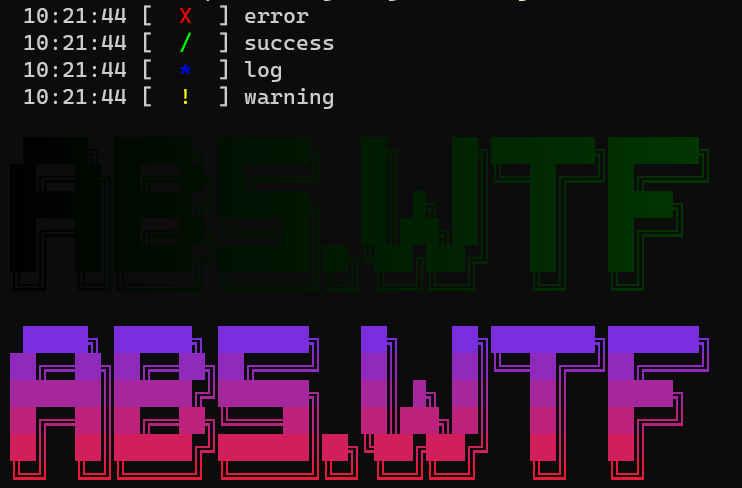

# ab5 logging package

## installation

run `go get github.com/xXA2005/ab5-logging` to install the package

## usage

```go
package main

import (
	"errors"
	"fmt"

	ab5 "github.com/xXA2005/ab5-logging"
)

func main() {
	logo := `
 █████╗ ██████╗ ███████╗   ██╗    ██╗████████╗███████╗
██╔══██╗██╔══██╗██╔════╝   ██║    ██║╚══██╔══╝██╔════╝
███████║██████╔╝███████╗   ██║ █╗ ██║   ██║   █████╗
██╔══██║██╔══██╗╚════██║   ██║███╗██║   ██║   ██╔══╝
██║  ██║██████╔╝███████║██╗╚███╔███╔╝   ██║   ██║
╚═╝  ╚═╝╚═════╝ ╚══════╝╚═╝ ╚══╝╚══╝    ╚═╝   ╚═╝     `
	ab5.Error(errors.New("error"))
	ab5.Success("success")
	ab5.Log("log")
	ab5.Warn("warning")
	fmt.Println(ab5.Horizontal(0, 0, 0, 100, 255, 50, logo), ab5.Reset) // from (0,0,0) to (100,255,50)
	fmt.Println(ab5.Vertical(100, 50, 255, 255, 20, 20, logo), ab5.Reset) // from (100,50,255) to (255,20,20)

}

```


